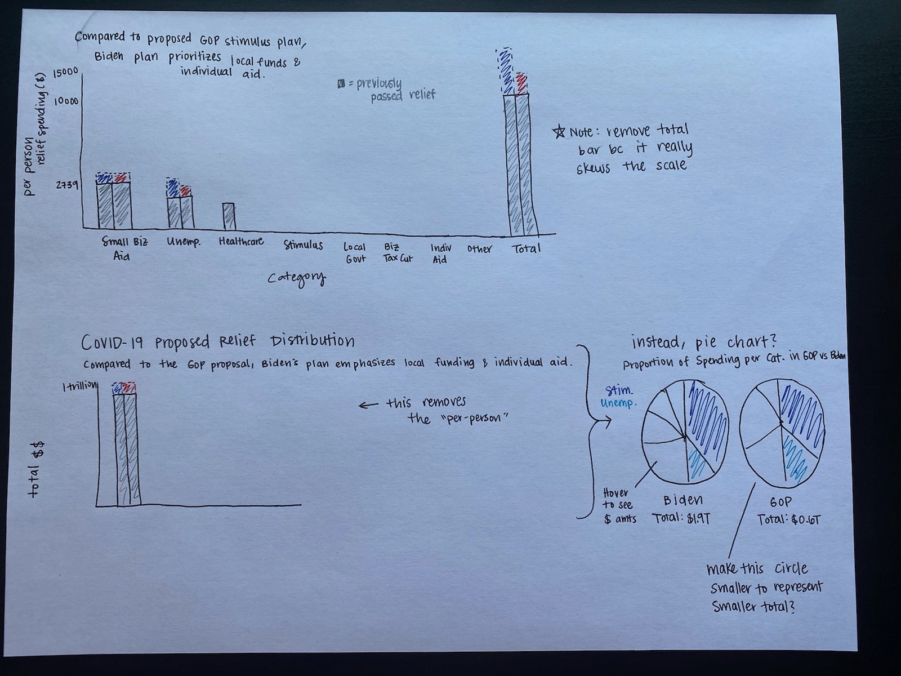

# Assignment 3 & 4: Critique by Design

## Original Visualization
The visualization I chose is from the article [Where $10K Per American in Covid Relief Has Gone, and What Might Come Next](https://www.nytimes.com/interactive/2021/02/11/upshot/covid-relief-spending-per-person.html) from *The New York Times* Upshot. It is the very first bar chart at the top of the page. I chose this visualization because it is relevant information that I am interested in. Despite the aesthetic appeal of the chart, the more I examined it the more I struggled to understand what was truly being said so I thought it would be a good candidate for resdesign. 

## The Critique Process
I first spent some time reflecting on what the visualization was trying to say. I had to read the article to glean additional context and understand what was happening. Then I approached the critique method and answered the questions. One thing I disliked about the Effectiveness Profile versus the Good Charts method is that the initial time I spent reflecting on the visualization wasn't part of the critique. Yes, there were measures on perceptibility and intuitiveness, but I  think I missed some insights because I wasn't writing down that very first impression and my comprehension process. 

The biggest insight I gained from the Effectiveness Profile was thinking about the truthfulness measure. I originally rated this chart an 8, but if I could go back I think I would alter that rating. I realized that I think this data is misrepresented here because they focus more on the dollar amount per-person rather than keeping it as a total sum or focusing on the distribution of the funds across the categories. An example to illustrate how the dollar amount per person is misleading is that it says that $1,388 per person has been passed previously in stimulus. However, most people actually received one payment of $1,200 and one payment of $600. This chart makes it seem like every person in the US qualifies for $1,388 and that's the maximum amount they can achieve since the total amount is divided by the US population. However, this is inaccurate and a misrepresentation -- not everyone qualifies for a stimulus and the amount each person receives varies. At no point does the chart clarify that, so it would be very easy to walk away with the wrong conclusion. 

In my wireframe, I focused on the part of the chart that I struggled with the most which was communicating the proportions of spending in the Biden plan vs. the GOP plan. It seemed to me that the most important piece of information to impart was that comparison between the Biden and GOP plan and that's what should be focused on. I initially thought about doing a bar chart, with two bars side-by-side, one with the already passed+Biden amount and one with the already passed+GOP amount. My first iteration kept it at a per-person spending amount and I also tried to include a bar for total. However, I ultimately decided that the per-person amount is misrepresentative still and that the total bar would skew the scale to be unable to see detail in the other categories. My next attempt was the same chart type, but I changed the scale to total amounts, removing the per person spending and the total bar. I also added a title and caption. However, the more I thought about it, the more I realized that the already passed information wasn't necessary if we're truly comparing the proportion of the Biden and GOP plan, so I moved to a pie chart. 

When I showed my wireframe to a couple people for feedback, they agreed with my thought process that the pie chart better illustrated the proportions of where each plan was spending the money. They felt that the design was overall clear, although one was unsure what all of the categories meant. However, that information can be gleaned through the article and wouldn't be helpful to put a longer explanation of the categories on the visualization. One person also noted that it might be helpful to somehow illustrate that the Biden plan is overall larger than the GOP plan, as the pie does remove the context of the actual amount spent. I ended up noting on my wireframe that it might be good to make the GOP pie smaller to reflect that it is a smaller total amount. 

## The Final Visualization
My final visualization is two pie charts that display the proportion of spending in each category of the two proposed plans. This better highlights the differences in where the money is going and does not misrepresent the data by using a per-person amount. The chart is interactive and hovering displays a tooltip that has the dollar amount, so that information is not lost. I chose to represent the Biden pie as larger than the GOP pie to reflect that the overall amount proposed is larger. This helps to focus in better on understand where the money is going because you can more easily compare across categories and see their overall priorities. I am not entirely sure about the color scheme I chose in the end as it may be too rainbow and busy. However, in keeping with the initial graphic and the article, it doesn't seem like they intend to callout specific categories, they're all equally important, so I used a full color scale.

function initViz() {
    var containerDiv = document.getElementById("vizContainer"),
    url = "https://public.tableau.com/views/CritiquebyDesignCovidRelief/Dashboard1?:language=en&:retry=yes&:display_count=y&publish=yes&:origin=viz_share_link";

    var viz = new tableau.Viz(containerDiv, url);
}

[Link to Tableau Public page](https://public.tableau.com/views/CritiquebyDesignCovidRelief/Dashboard1?:language=en&:display_count=y&publish=yes&:origin=viz_share_link)

[Return to Homepage](/README.md)
